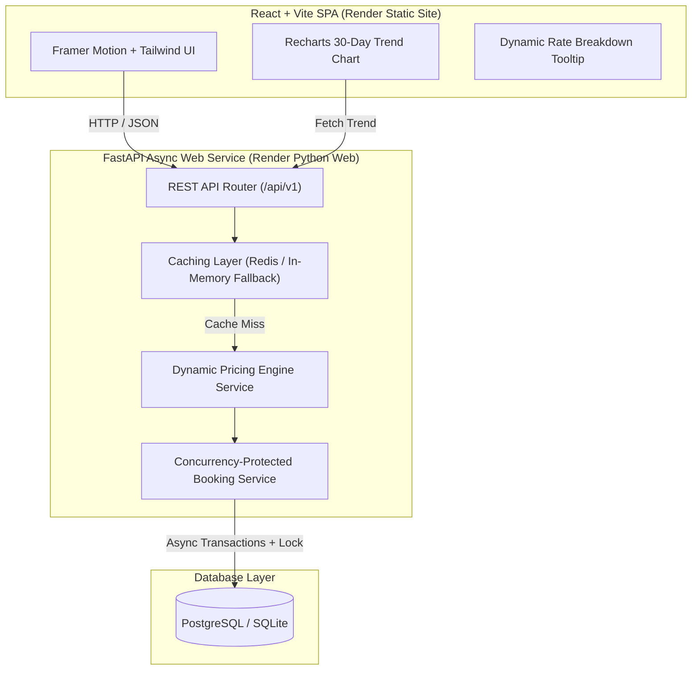

# 🏨 Zenith — Dynamic Hotel Pricing & Availability Engine

[](https://github.com/RahulAditya22/zenith-hotel-pricing-platform/actions)
[](https://python.org)
[](https://fastapi.tiangolo.com)
[](https://react.dev)
[](https://tailwindcss.com)
[](https://render.com)

> **Live Production Demo**: [https://zenith-frontend.onrender.com](https://zenith-frontend.onrender.com)  
> **Interactive OpenAPI Docs**: [https://zenith-backend.onrender.com/docs](https://zenith-backend.onrender.com/docs)

---

## 📌 Project Overview

**Zenith** is a full-stack multi-property hotel booking platform and dynamic rate engine inspired by revenue management systems used by Booking.com and Agoda. It calculates room rates in real time based on date-specific inventory commitments, booking window lead times, calendar day-of-week premiums, and regional demand events while providing a process-safe lock to prevent room overbooking under concurrent traffic.

---

## 🏗 System Architecture



---

## 🧮 Pricing Engine Formula

The nightly price $P_{final}$ for a room type on a target date is computed using 4 decoupled factors bounded between a safety floor ($0.50 \times P_{base}$) and safety ceiling ($3.00 \times P_{base}$):

$$P_{final} = \text{round}\left(\min\left(\max\left(P_{base} \times M_{occ} \times M_{lead} \times M_{dow} \times M_{event}, \, 0.50 \cdot P_{base}\right), \, 3.00 \cdot P_{base}\right), \, 2\right)$$

### 1. Occupancy Multiplier ($M_{occ}$)
Calculated based on booked room percentage $O = \frac{\text{Booked Rooms}}{\text{Total Capacity}}$:
- $O < 30\% \rightarrow \mathbf{0.85\times}$ (Incentive rate)
- $30\% \le O < 60\% \rightarrow \mathbf{1.00\times}$ (Baseline rate)
- $60\% \le O < 80\% \rightarrow \mathbf{1.20\times}$ (High demand surge)
- $80\% \le O < 95\% \rightarrow \mathbf{1.40\times}$ (Critical surge)
- $O \ge 95\% \rightarrow \mathbf{1.65\times}$ (Last-unit capacity surge)

### 2. Lead Time Multiplier ($M_{lead}$)
Calculated based on $D = (\text{Check-in Date} - \text{Booking Date}).\text{days}$:
- $D \le 2$ days $\rightarrow \mathbf{1.25\times}$ (Last-minute premium)
- $3 \le D \le 7$ days $\rightarrow \mathbf{1.10\times}$ (Short-notice rate)
- $8 \le D \le 30$ days $\rightarrow \mathbf{1.00\times}$ (Standard window)
- $31 \le D \le 60$ days $\rightarrow \mathbf{0.92\times}$ (Early bird discount)
- $D > 60$ days $\rightarrow \mathbf{0.85\times}$ (Advance purchase discount)

### 3. Day-of-Week Multiplier ($M_{dow}$)
- Friday & Saturday nights: $\mathbf{1.20\times}$ (Weekend leisure surge)
- Sunday night: $\mathbf{1.05\times}$
- Mon–Thu: $\mathbf{1.00\times}$

### 4. Demand Event Multiplier ($M_{event}$)
Matches active events in the city (e.g., Art Basel 1.45x, Fashion Week 1.60x, Tech Summit 1.35x).

---

## ⚡ Concurrency Safety & Overbooking Prevention

To guarantee zero double-bookings when multiple users attempt to reserve the last available room simultaneously:
- **Async Concurrency Lock**: `BookingService` enforces an `asyncio.Lock()` critical section during room availability validation and reservation persistence.
- **Overlapping Date Range Check**: Validates total confirmed rooms booked across every single night in the date range $[ \text{check\_in}, \text{check\_out} )$.
- **Conflict Handling**: If $\text{total\_rooms} - \text{max\_booked} \le 0$, the engine immediately rejects the transaction with an HTTP 409 Conflict.

---

## 🛠 Local Setup & Running

### 1. Backend Setup

```bash
# Navigate to backend directory
cd backend

# Create Python 3.11+ virtual environment
python -m venv venv

# Activate virtual environment
# Windows:
.\venv\Scripts\activate
# Linux/macOS:
source venv/bin/activate

# Install requirements
pip install -r requirements.txt

# Seed realistic property and event data
python scripts/seed_data.py

# Run development server
uvicorn app.main:app --reload --port 8000
```
Backend API will be available at `http://localhost:8000` with interactive Swagger docs at `http://localhost:8000/docs`.

### 2. Frontend Setup

```bash
# Navigate to frontend directory
cd frontend

# Install dependencies
npm install

# Start Vite dev server
npm run dev
```
Frontend UI will be running at `http://localhost:5173`.

---

## 🧪 Testing

Run the full pytest suite (including pricing unit tests, API integration tests, and concurrency safety tests):

```bash
cd backend
pytest
```

---

## 💡 Key Design Decisions & Trade-Offs

1. **Decoupled Pricing Engine**: The pricing rules are implemented behind an abstract interface (`PricingEngineInterface`). This allows swapping in a trained ML model (e.g. XGBoost rate predictor) in the future without changing database schemas or API endpoints.
2. **Redis + In-Memory Fallback**: For search traffic, the search service queries a caching layer. If Redis is not configured or unavailable, it cleanly falls back to a thread-safe `InMemoryCache` with TTL expiry.
3. **Pessimistic Concurrency Locking**: In production under high concurrency, process-level locking combined with SQLAlchemy database transactions guarantees strict inventory isolation without race conditions.

---

## 📄 License

MIT License. Designed and engineered as a senior portfolio piece.
